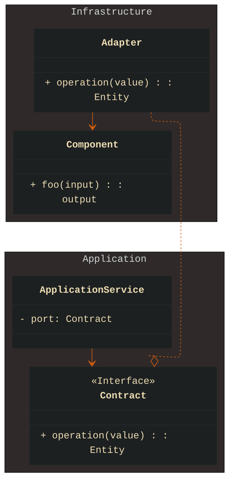
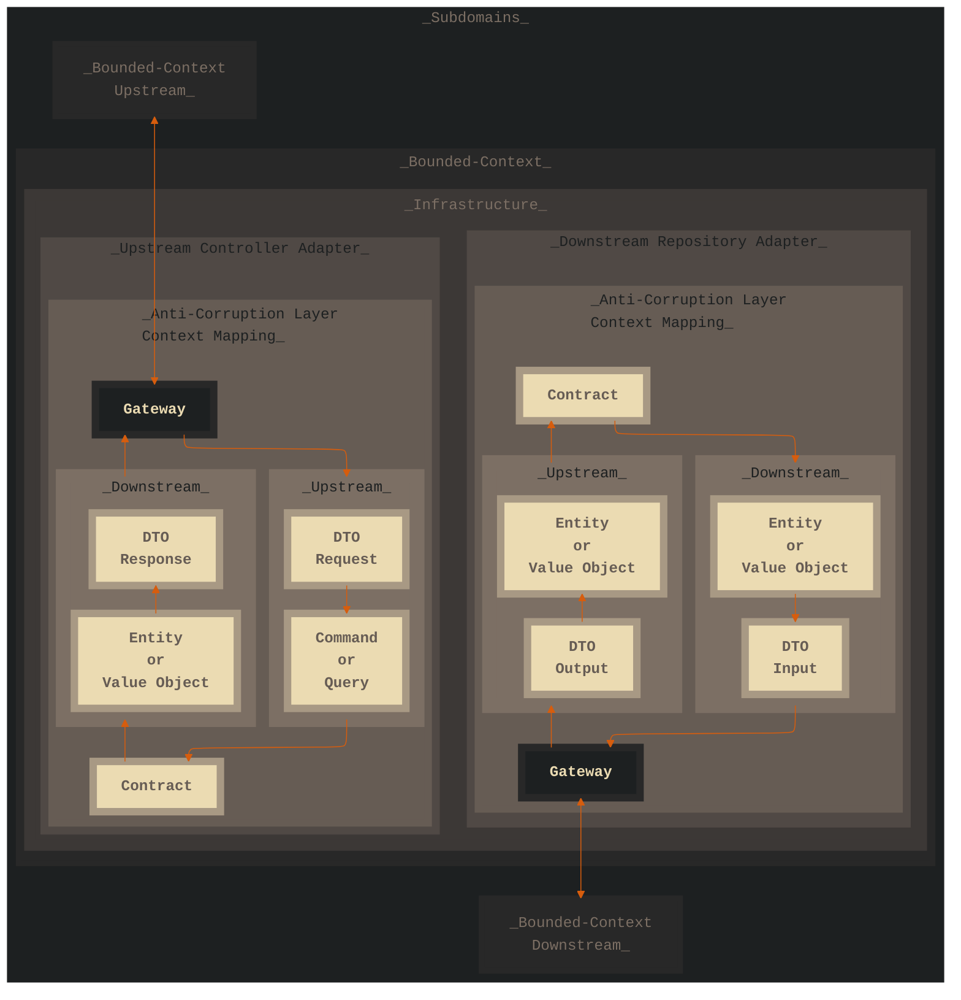
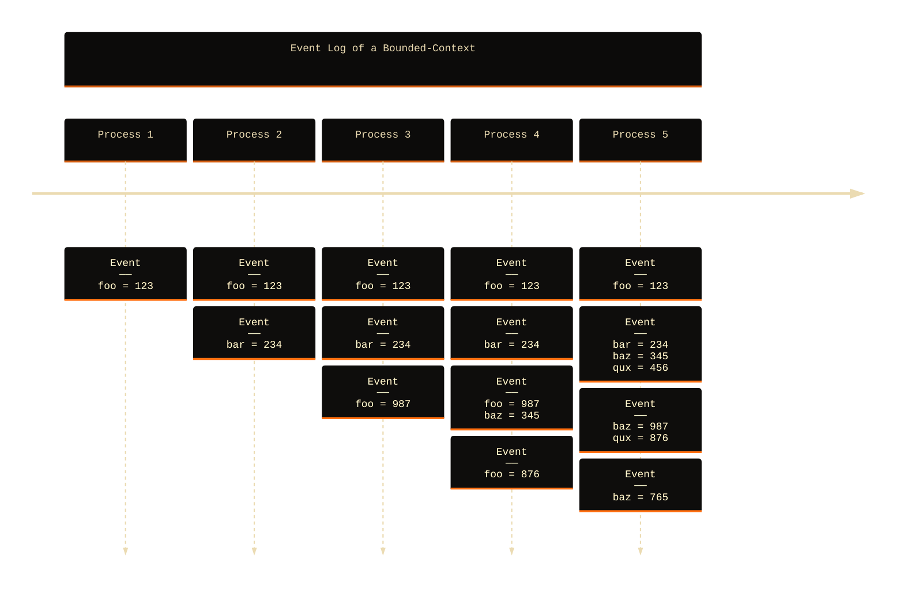
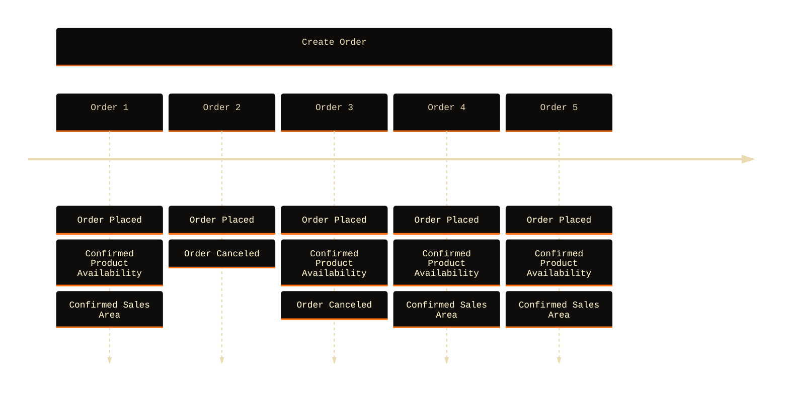
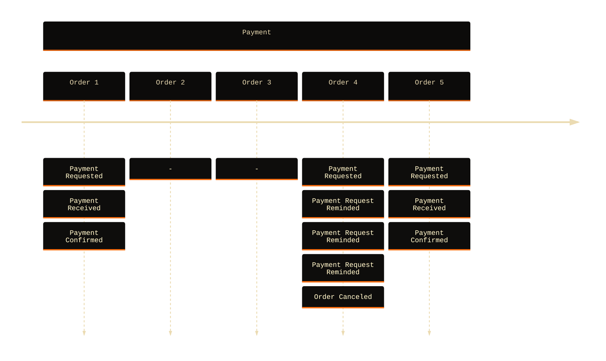
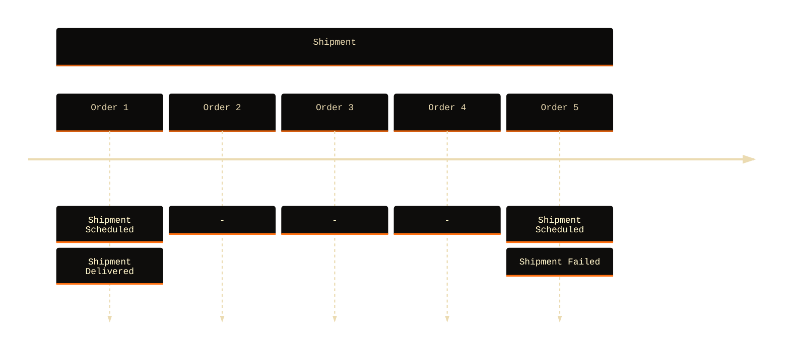
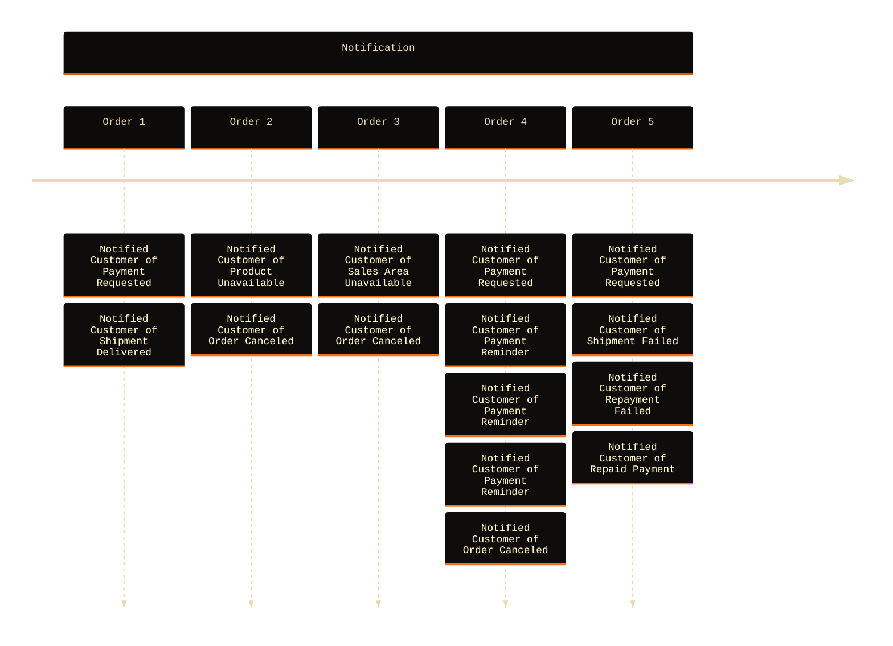
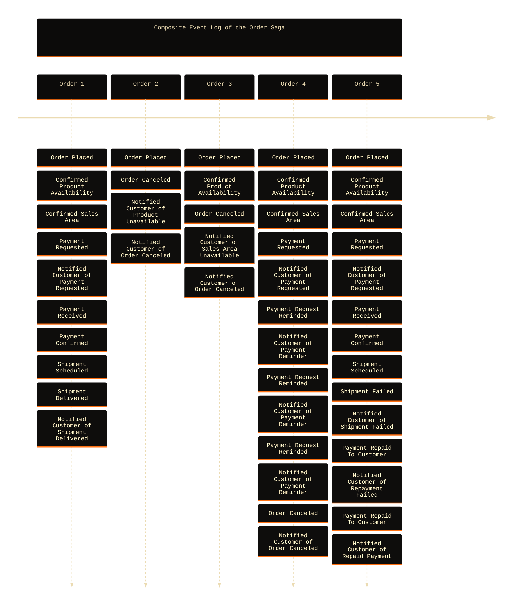

# Core Architecture Principles

###### Standards and Examples

---

## Philosophy

The architectural approach described here is inspired by, and aligns with, well-defined architectural principles in **Domain-Driven Design**, **Onion Architecture**, and **Hexagonal Architecture**, where **core business** logic is isolated at the center of the solution. Contextual boundaries are protected by relying on adapted implementations of clearly defined interfaces (**ports**).

- **Core logic has no concrete dependencies:** Adapter-patterns enable simpler unit testing.
- **Core logic remains stable despite infrastructural changes:** Ensures domain stability.
- **Adapters can be swapped independently:** Simplifies refactoring.

### Component Isolation & Dependency Direction

These standards advocate a **component isolation policy**, meaning a component must remain isolated from the problem spaces of other components, and should not address problems beyond its contextual scope.

- Components benefit from clearly defined boundaries and responsibilities.
- Isolated components remain stable when coupled components change.
- Isolated components are simpler to test individually.



The adapter-pattern described above ensures **component isolation**, reducing coupling by abstracting the dependency, using a contracted interface implemented by one or more adapters of different solutions to the contracted problem.

The adapter-pattern described implements the **Dependency Inversion Principle** described by Robert C. Martin - _High-level modules should not depend on low-level modules. Both should depend on abstractions._ A principle that confronts **tight coupling**.

**Tight coupling** occurs when components, modules, or classes are strongly dependent on each other's internal structure or behavior. A change in one component forces changes in others - defining instability, causes a maintenance overhead.

---

## Layered Architecture

A Layered Architecture organizes a system into hierarchical layers, each with distinct roles and responsibilities.

- **Separation of concerns:** Each layer addresses specific responsibilities.
- **Direction of dependencies:** Higher layers depend only on lower layers, never vice versa.
- **Dependency inversion:** Domain and application layers define interfaces, implemented by the infrastructure layer.

### Onion Architecture

In **Onion Architecture**, the core domain model is at the center, surrounded by layers such as **Infrastructure**, **API**, and **View**, creating clear boundaries and a defined direction for dependencies; outer layers may depend inward, but never outward.

- Decouples business logic from infrastructure specifics.
- Each layer evolves independently.
- Changes in external systems has less impact on core behavior.

### Hexagonal (Ports and Adapters)

Inspired by **Hexagonal Architecture**, the system uses **adapters** for external interactions at upstream (input) and downstream (output) boundaries. The application layer defines **ports** (interfaces), and external infrastructural interactions are implemented via adapters (**plugs**).

Adapters commonly implement:

- Gateways for APIs or protocols.
- Repositories interacting with data layers.
- Controllers and middleware.

This architectural approach improves the ability to adapt and test the solution in isolation from the deployment context.

### Domain-Driven Design (DDD)

> Solutions should reflect the language and needs of stakeholders to the solution!

The architectural principles described originate from **Domain-Driven Design**, which organizes software around business concepts, using a **ubiquitous language** developed with **domain experts** to ensure clarity and reduce miscommunication.

- The **domain experts** are one or many, with practical experience, preferably a stakeholder in the solution.
- The **ubiquitous language** is derived from the domain and the **domain experts**, not invented by engineers.

#### Core, Supporting, and Generic Domains

A domain addresses a specific business problem and can be decomposed into more focused **subdomains** that contextualize problems that are more or less relevant to what is important. Described by the **Domain-Driven Design** doctrine, a domain space can be differentiated as follow:

- **Core Domain:** The business-critical part of the system. High-value logic important to the business.
- **Supporting Subdomain:** Enables core functionality, _e.g., logging, auditing, etc_.
- **Generic Subdomain:** Replaceable third-party functionality, _e.g., services, libraries, etc_.

Clearly defined boundaries (**bounded-contexts**) clarify the separation of concerns and guide component design.

#### Bounded-Context

A **bounded-context** encapsulates a consistent domain model, language, and behavior, typically centered around an **aggregate root**, but may also align with business capabilities or departments.

#### Microservices and Domain Logic

A **microservice** in this context hosts a specific domain responsibility, named semantically to reflect the domain solution it provides.

#### Aggregate

An **aggregate** organizes domain **entities** and **value objects** hierarchically around an **aggregate root**, enforcing domain policies and consistency.

#### Entity

An **Entity** is an object that has a distinct identity. **Example:** a user or sales-order in a system is identified by a unique ID and can be identified even if their attributes changes.

#### Value Object

A **Value Object** represents a descriptive aspect of the domain with no conceptual identity; it is defined only by its imutable value.

#### Event

An **event** is expected to describe something that has happened, not the intention to do something.

### Event Sourcing and CQRS (Command Query Responsibility Segregation)

Inspired by Greg Young’s principles, the stack promotes a clear separation between read and write models:

- **Commands:** Trigger state changes and emit events, _e.g., the write model_.
- **Queries:** Optimized projections for reading, _e.g., the read model_.

The architecture supports design patterns such as **event replay**, **sagas**, and **process managers**, enabling robust, reactive designs.

The **Eventflow** component in the **Superhero Tool Chain** implements an eventual consistency model, providing contracts for process orchestration and event sourcing in a horizontally scalable architecture.

---

## Standard Operating Procedures

These **Standard Operating Procedures (SOP)** are detailed, documented instructions that define how to implement the specified architecture. They serve as a blueprint for processes, workflows and strategies.

### Contextual Boundaries

Software boundaries separate domain responsibilities into bounded-contexts, each structured into layers: **infrastructure** (I/O implementations), **application** (orchestration), and **domain** (business logic).

```mermaid
---

config:
    layout: elk
    theme: base
    themeVariables:
        fontFamily: "monospace"
        lineColor: "#D65D0E"

---

flowchart TB
    subgraph Subdomains["_Subdomains_"]
        subgraph Core["_Core Domain_<br>_Bounded-Context_"]
            subgraph Infrastructure["_Infrastructure_"]
                subgraph InfrastructureQuery["_Query_"]
                    subgraph InfrastructureQueryUpstream["_Upstream_<br>_Controller_"]
                        InfrastructureQueryUpstreamAdapter[Adapter]
                    end

                    subgraph InfrastructureQueryDownstream["_Downstream_<br>_Repository_"]
                        InfrastructureQueryDownstreamAdapter[Adapter]
                    end
                end

                subgraph InfrastructureCommand["_Command_"]
                    subgraph InfrastructureCommandUpstream["_Upstream_<br>_Controller_"]
                        InfrastructureCommandUpstreamAdapter[Adapter]
                    end

                    subgraph InfrastructureCommandDownstream["_Downstream_<br>_Repository_"]
                        InfrastructureCommandDownstreamAdapter[Adapter]
                    end
                end
            end

            subgraph Application["_Application<br>Orchestration_"]
                subgraph ApplicationQuery["_Query_"]
                    subgraph QueryApplicationService["_Application Service_"]
                        Resolver:::implementation
                    end

                    subgraph ApplicationQueryContract["_Contract_"]
                        subgraph ApplicationQueryContractUpstream["_Upstream_<br>_Controller_"]
                            ApplicationQueryContractUpstreamInterface[Interface]
                        end

                        subgraph ApplicationQueryContractDownstream["_Downstream_<br>_Repository_"]
                            ApplicationQueryContractDownstreamInterface[Interface]
                        end
                    end
                end

                subgraph ApplicationCommand["_Command_"]
                    subgraph CommandApplicationService["_Application Service_"]
                        Interactor[Interactor]:::implementation
                    end

                    subgraph ApplicationCommandProcess["_Process Manager_"]
                        ApplicationCommandProcessSaga[Saga]
                    end

                    subgraph ApplicationCommandContract["_Contract_"]
                        subgraph ApplicationCommandContractUpstream["_Upstream_<br>_Controller_"]
                            ApplicationCommandContractUpstreamInterface[Interface]
                        end

                        subgraph ApplicationCommandContractDownstream["_Downstream_<br>_Repository_"]
                            ApplicationCommandContractDownstreamInterface[Interface]
                        end
                    end
                end
            end

            subgraph Domain[_Domain_]
                DomainAggregate[Aggregate] --> DomainSchema
                subgraph DomainSchema[_Schema_]
                    DomainEntity[Entity] --> DomainValueObject[Value Object]
                end
            end

            CommandApplicationService   --> ApplicationCommandContract
            QueryApplicationService     --> ApplicationQueryContract

            InfrastructureCommandDownstream -.-o ApplicationCommandContractDownstream
            InfrastructureCommandUpstream   -.-o ApplicationCommandContractUpstream
            InfrastructureQueryDownstream   -.-o ApplicationQueryContractDownstream
            InfrastructureQueryUpstream     -.-o ApplicationQueryContractUpstream

            ApplicationCommandProcess   --> ApplicationCommandContractDownstream
            ApplicationQueryContract    --> Domain
            ApplicationCommandContract  --> Domain
        end

        subgraph SubdomainsGroup["░░░░░░░░░░░░░░░░░"]
            subgraph SupportingSubdomains["_Supporting Subdomains_"]
                SupportingSubDomainsBoundedContexts["Other Bounded-Contexts"]
            end

            subgraph GenericSubdomains[_Generic Subdomains_]
                GenericSubdomainsBoundedContexts[Other Bounded-Contexts]
            end
        end

        InfrastructureQueryDownstream   --> SubdomainsGroup
        InfrastructureCommandDownstream --> SubdomainsGroup
        InfrastructureQueryDownstream   --> SubdomainsGroup
        InfrastructureCommandDownstream --> SubdomainsGroup
        SupportingSubdomains            --> GenericSubdomains
    end

    classDef nsDepth_1 fill:#1D2021,stroke:#1D2021,color:#7C6F64
    classDef nsDepth_2 fill:#282828,stroke:#282828,color:#7C6F64,stroke-width:6px
    classDef nsDepth_3 fill:#3C3836,stroke:#3C3836,color:#7C6F64,stroke-width:12px
    classDef nsDepth_4 fill:#504945,stroke:#504945,color:#1D2021
    classDef nsDepth_5 fill:#665C54,stroke:#665C54,color:#1D2021,stroke-width:8px
    classDef nsDepth_6 fill:#7C6F64,stroke:#7C6F64,color:#1D2021,stroke-width:16px
    
    classDef implementation fill:#1D2021,stroke:#282828,font-weight:bold,stroke-width:8px,color:#EBDBB2
    classDef contract fill:#EBDBB2,stroke:#A89984,font-weight:bold,stroke-width:8px,color:#665C54

    class Subdomains,SubdomainsGroup nsDepth_1
    class Core,SupportingSubdomains,GenericSubdomains nsDepth_2
    class Infrastructure,Application,Domain,SupportingSubDomainsBoundedContexts,GenericSubdomainsBoundedContexts nsDepth_3
    class DomainSchema,InfrastructureQuery,InfrastructureCommand,ApplicationQuery,ApplicationCommand nsDepth_4
    class InfrastructureCommandDownstream,InfrastructureCommandUpstream,InfrastructureQueryDownstream,InfrastructureQueryUpstream,ApplicationQueryContract,ApplicationCommandProcess,ApplicationCommandContract,CommandApplicationService,QueryApplicationService nsDepth_5
    class ApplicationQueryContractUpstream,ApplicationQueryContractDownstream,ApplicationCommandContractUpstream,ApplicationCommandContractDownstream nsDepth_6
    
    class DomainEntity,DomainValueObject,ApplicationQueryContractUpstreamInterface,ApplicationQueryContractDownstreamInterface,ApplicationCommandContractUpstreamInterface,ApplicationCommandContractDownstreamInterface contract
    class InfrastructureQueryUpstreamAdapter,InfrastructureQueryDownstreamAdapter,InfrastructureCommandUpstreamAdapter,InfrastructureCommandDownstreamAdapter,ApplicationCommandProcessSaga,DomainAggregate implementation
```



_Interaction lines in the architecture express dependency and implementation strategies that show how, and in what direction - boundaries are expected to be broken._

- **Infrastructure Layer:** Where upstream controllers and downstream repositories are implemented.
- **Application Layer:** Responsible for orchestration between infrastructural implementations and the Domain layer.
- **Domain Layer:** Implements the domain-specific business logic.
- **Command Layer:** Write model responsible for persistence modifications in the data layer.
- **Query Layer:** Read model responsible for projections of the data layer.
- **Controller:** Upstream layer responsible for input adapters.
- **Repository:** Downstream layer responsible for output implementations of cross boundary interactions.
- **Adapter:** Adapts infrastructural components to domain-specific expectations.
- **Process Manager:** Command Layer for implementations responsible for process orchestration.
- **Contract:** Interfaces that express what implementations the domain requires to be able to fulfill the domain-specific business logic.
- **Saga:** Process managers that orchestrates domain-specific reactions to domain events.
- **Aggregate:** Implements the domain-specific atomic business logic that guarantees business policies within the contextual boundary.
- **Schema:** Responsible for ensuring data integrity of the data representations it specify.
- **Entity:** A persistent domain object with a unique identity, governed by its aggregate root.
- **Value Object:** A domain object without identity, defined by the value of its attribute(s), often typically used to represent attributes of an Entity.

### Anti-Corruption Layer & Context Mapping

Interactions between contexts use an **Anti-Corruption Layer** implementing context mappers to ensure data integrity, translating external representations into domain-specific structures, _e.g., `Entities` and `Value Objects`_.



- **Anti-Corruption Layer:** Asserts adapted data integrity.
- **Context-Mapper:** Translates data structures, implements guards against data corruption, such as external domain inconsistencies, or unintended data formats, and converts inconsistencies into domain expected representations, by returning or throwing the translated data representation.
- **DTO:** Stands for "Data Transfer Object", it's a naming convention of an unspecific data structure in transit; unknown to the domain.
- **Gateway:** The implemented client of the transit protocol used to communicate with the subdomain - the external bounded-context.

### Source Code File Structure

These standards describe a file structure and naming convention of the source code. The standard described focuses on the domain language of the solution, rather than the technical terminologies, e.g,. layers, component types, design patterns, etc.

By using an approach that implements the domain language to structure the directories and file names of the source code, the aim is to reduce, or entirely remove - the technical terminologies from this scope.

This model aligns with the **ubiquitous language** of the domain, expressing the semantic design of the architecture.

- The standard defines a **bounded-context** directory to organize the source code of a **subdomain** in. The **bounded-context** is expected to be listed next to other subdomains of the domain scope.
- The name of the **bounded-context** directory should align with the name of the **subdomain**, which typically share name with the **aggregate root** of the **bounded-context**, or else is expected to follow a **noun-driven** naming convention, _e.g., billing, catalog, identity, shipping, etc_.
- The files expected to be listed directly in the **bounded-context** are the components of the **domain layer**, _e.g., Aggregates, Entities, Value Objects, etc_.
- The direct subfolders in the **bounded-context** directory is expected to list the different **operations** of the domain, following a **verb-driven** naming convention that semantically expresses the **use cases** of the **operations**, _e.g., create-invoice, disable-user, get-order-history, etc_.
- Files in the **use cases** directories are the componets of both the **application** and **infrastructure layers**, _e.g., Adapters, Application Services, Contracts, etc_.
- Names of both **directories** and **folders** are expected to use **lower-case** and **hyphen-separated** formats.

#### Example Use Case: Message Board

Defined below is an example of a file structure that implements the **Source Code File Structure SOP** described above. The example represents a simple message board solution. The file structure represents a smaller and simplified domain model, focused on serving as an example.

```
message-board                             # Domain name.
└ src                                     # Source code directory.
  ├ database                              # Supporting database domain responsible for abstracting the database connection.
  │ ├ gateway.js                          # Database gateway contract.
  │ ├ gateway-mock.js                     # Mocked implementation of the database gateway contract.
  │ └ gateway-mysql.js                    # Mysql client implementation of the database gateway contract.
  ├ post                                  # Core Domain.
  │ ├ create                              # Use case of a domain operation.
  │ │ ├ access.js                         # Upstream contract for the implementation of the controller adapter.
  │ │ ├ access-using-http.js              # The adapter of the upstream controller that implements the "access" contract.
  │ │ ├ command.json                      # Schema of the command model.
  │ │ ├ persist.js                        # Downstream contract for the implementation of the repository adapter.
  │ │ ├ persist-in-database.js            # Adapter of the downstream repository that implements the "persist" contract.
  │ │ ├ persist-in-database.sql           # The SQL query used to persist the post in the database.
  │ │ ├ persist-in-databas-using-http.js  # Application service responsible for the orchestration of the interaction.
  │ │ └ route.json                        # Schema specifying the http route policy.
  │ ├ view                                # ...use case...
  │ │ ├ access.js                         # ...upstream contract...
  │ │ ├ access-using-http.js              # ...upstream adapter...
  │ │ ├ find.js                           # ...downstream contract...
  │ │ ├ find-in-database.js               # ...downstream adapter...
  │ │ ├ find-in-database.sql              # ...SQL query...
  │ │ ├ find-in-database-using-http.js    # ...orchestrator...
  │ │ ├ query.json                        # Schema of the query model.
  │ │ └ route.json                        # ...route schema...
  │ ├ post.js                             # Aggregator of the bounded-context.
  │ └ post.json                           # Entity schema of the aggregate root.
  └ user                                  # Supporting user domain responsible for authentication and authorization.
    ├ find                                # Common use case to find a user.
    │ ├ find.js                           # ...downstream contract...
    │ ├ find-in-database.js               # ...downstream adapter...
    │ └ find-in-database.sql              # ...SQL query...
    ├ hash-password                       # Common use case to hash a password.
    │ ├ hash-password.js                  # ...downstream contract...
    │ └ hash-password-using-bcrypt.js     # ...downstream adapter...
    ├ login                               # ...
    │ ├ access.js
    │ ├ access-using-http.js
    │ ├ command.json
    │ ├ create-session.js
    │ ├ create-session-in-database.js
    │ ├ create-session-in-database.sql
    │ ├ create-session-in-database-using-http.js
    │ └ route.json
    ├ logout
    │ ├ access.js
    │ ├ access-using-http.js
    │ ├ command.json
    │ ├ terminate-session.js
    │ ├ terminate-session-in-database.js
    │ ├ terminate-session-in-database.sql
    │ ├ terminate-session-in-database-using-http.js
    │ └ route.json
    ├ session.json
    ├ user.js
    └ user.json
```

### Event Log & Projection

An **event log** is a log stream, it belongs to a **bounded-context** and is a vector of events that is grouped by a process identity, ordered by when in time the events where persisted.


The benefits of working with a solution that implements an **event log** of each commanded process:

- **Auditability:** Every change is recorded as an immutable event, providing historical traceability.
- **Regulatory Compliance:** Often a legal and financial requirement to keep an immutable transaction history.
- **Projections:** Provides a consistent version state of the processed schema evolution that can be queried.
- **Simulation:** Can be used to simulate the future of a process, or how a similar process would evolve.
- **Decoupling:** Downstream implementations can react to events decoupled from the broadcaster.

#### Projection of the Event Log State

An **event log** offers a **time-dimensional** view of the evolved process schema state. To create a **flat stateful** data representation of the **time-dimensional** data representation, the event bodies of the **event log** are merged together.



The above example shows a set of **time-dimensional event log representations** ranging between `Process 1` and `Process 5`. Translating them into a set of **flat stateful representations** of the same **event logs**, then the event data is merged into the following projections:

```
---

config:
    layout: elk
    theme: base
    themeVariables:
        fontFamily: "monospace"
        primaryColor: "#504945"
        primaryTextColor: "#EBDBB2"
        cScaleInv0: '#D65D0E'

---

timeline
    section Event Log States of a Bounded-Context
        Process 1 : State<br>──<br>foo = 123 
        Process 2 : State<br>──<br>foo = 123<br>bar = 234 
        Process 3 : State<br>──<br>foo = 987<br>bar = 234
        Process 4 : State<br>──<br>foo = 876<br>bar = 234<br>baz = 345
        Process 5 : State<br>──<br>foo = 123<br>bar = 234<br>baz = 765<br>qux = 876
``` 

#### Composite Event Log

The **event log** belongs to a **bounded-context**, a **composite event log** is a unified log stream from multiple **bounded-context** sources. The **composite event log** represents a cohesive narrative across phases of a **saga** or a process. 

The term **composite event log** emphasizes that the log is not from a single source, but constructed from several sources - possibly filtered or correlated.

#### Saga & Process Choreography

A **saga** is a series of significant events that unfolds the story of how the resulting narrative evolves. It is a reactive, long-running transaction spanning multiple contexts, triggered by events and describes compensating logic for handling edge cases and failures.

The solution design outlined here expects a write model that implements **process managers** in different **bounded-contexts** that orchestrate a choreographed **reactional event model** to a domain **saga**.

#### Example Use Case: Order Lifecycle

This example uses a **saga** that governs an **Order Fulfillment Process** where each phase (ordering, payment, shipment, notifications) involves event-driven choreography, compensations, retries, and consistent customer communication.

```mermaid
---

config:
    layout: elk
    theme: base
    themeVariables:
        background: "#1D2021"
        fontFamily: "monospace"
        primaryColor: "#1D2021"
        primaryTextColor: "#EBDBB2"

        actorBorder: "#282828"
        actorTextColor: "#7C6F64"
        actorLineColor: "#1D2021"
        signalColor: "#D65D0E"
        signalTextColor: "#EBDBB2"
        labelBoxBkgColor: "#1D2021"
        labelBoxBorderColor: "#D79921"
        labelTextColor: "#D65D0E"
        loopTextColor: "#D79921"
        activationBorderColor: "#1D2021"
        activationBkgColor: "#D79921"
        sequenceNumberColor: "#000000"

---

sequenceDiagram
    title Order Saga
    autonumber

    box rgb(40, 40, 40) Create Order
        participant A1 as Order Placed
        participant A0 as Order Canceled
        participant A2 as Confirmed Product Availability
        participant A3 as Confirmed Sales Area
    end
    box rgb(40, 40, 40) Payment
        participant B1 as Payment Requested
        participant B3 as Payment Not Received
        participant B4 as Payment Not Received After 3 Reminders
        participant B7 as Payment Request Reminded
        participant B2 as Payment Received
        participant B5 as Payment Confirmed
        participant B6 as Payment Repaid To Customer
    end
    box rgb(40, 40, 40) Shipment
        participant C1 as Shipment Scheduled
        participant C2 as Shipment Delayed
        participant C3 as Shipment In Transit
        participant C4 as Shipment Delivered
        participant C5 as Shipment Failed
    end
    box rgb(40, 40, 40) Notification
        participant D0  as Notified Customer of Order Canceled
        participant D1  as Notified Customer of Product Unavailable
        participant D2  as Notified Customer of Sales Area Unavailable
        participant D3  as Notified Customer of Shipment Delayed 
        participant D4  as Notified Customer of Shipment In Transit
        participant D5  as Notified Customer of Shipment Delivered
        participant D6  as Notified Customer of Shipment Failed 
        participant D7  as Notified Customer of Repaid Payment 
        participant D8  as Notified Customer of Payment Requested 
        participant D9  as Notified Customer of Payment Reminder
        participant D10 as Notified Customer of Repayment Failed
        participant D11 as Notified Security of Invalid Payment Confirmation
    end
    
    A1->>A2: Confirm Product Availability
    
    alt
        A1--xA2: Product Not Available
        A1->>D1: Notify Product Not Available 
        A1->>A0: Cancel Order
        A0->>D0: Notify Customer of Canceled Order
    else
        A2->>A3: Confirm Sales Area
    end

    alt
        A2--xA3: Sales Area Unavailable
        A2->>D2: Notify Unavailable Sales Area
        A2->>A0: Cancel Order
        A0->>D0: Notify Customer of Canceled Order
    else
        A3->>B1: Request Payment
    end

    B1->>D8: Notify Payment Status to Customer

    loop
        B3-->B3: Payment Not Received

        alt
            B3->>B7: Remind Customer of Payment Request
            B7->>B1: Request Payment
            B7->>D9: Notify Payment Status to Customer
        else
            B4->>B5: Payment Not Received After 3 Reminders
            B5->>A0: Cancel Order
            A0->>D0: Notify Customer of Canceled Order
        end
    end

    B2-->B2: Payment Received
    B2->>B5: Confirm Payment

    alt
        B2--xB5: Invalid Payment Confirmation
        B2->>D11: Notify Security of Invalid Payment Confirmation
    else
        B5->>C1: Schedule Shipment
    end

    C2-->C2: Shipment Delayed
    C2->>D3: Notify Shipment Status to Customer

    C3-->C3: Shipment In Transit
    C3->>D4: Notify Shipment Status to Customer

    C4-->C4: Shipment Delivered
    C4->>D5: Notify Shipment Status to Customer

    C5-->C5: Shipment Failed
    C5->>D6: Notify Shipment Status to Customer
    
    C5->>B6: Repay Customer

    alt
        C5--xB6: Failed to Repay Customer

        loop
            C5->>B6: Retry to Repay Customer
            C5->>D7: Notify Payment Status
        end
    else
        B6->>D10: Notify Payment Status to Customer
    end
```



**Create Order:**

- Begins when an order is placed (`Order Placed`).
- The product availability is confirmed; failure results in cancellation and customer notification.
- If available, the sales area is confirmed; failure also leads to cancellation.
- Success in both leads to the payment phase.

**Payment:**

- Payment is requested and the customer is notified.
- If no payment is received, reminders are issued. After three failed attempts, the order is canceled.
- If payment is received, it must be verified.
- Invalid payment confirmations trigger alerts to the security context.

**Shipment:**

- Upon payment confirmation, a shipment is scheduled.
- The process handles real-world conditions: delays, transit, delivery, or failure.
- In case of failure, the customer is refunded; retry logic is applied if repayment fails.

**Notification:**

- At each decision point, the customer is kept informed.
- Notifications reflect product availability, payment reminders, shipment status, cancellations, and repayment status.
- Security is notified in case of suspicious activity, _e.g., invalid payment_.

Examples below are different timeline event log representations of choreographed orders processed by the **saga** described above.









Below example shows a **composite event log** representation of the same event log examples listed above.


