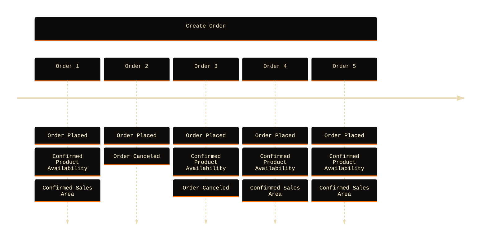
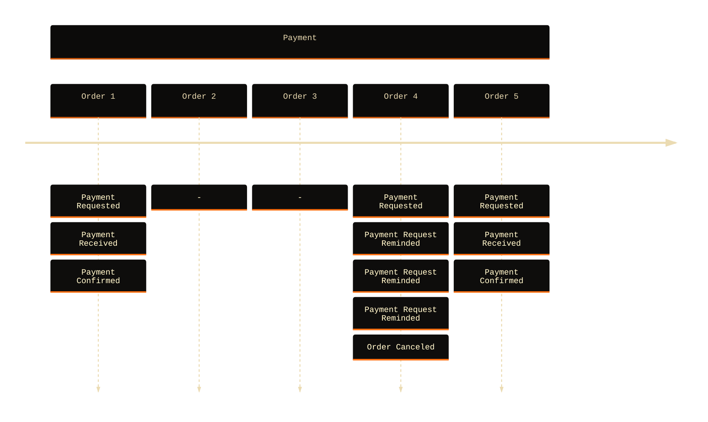
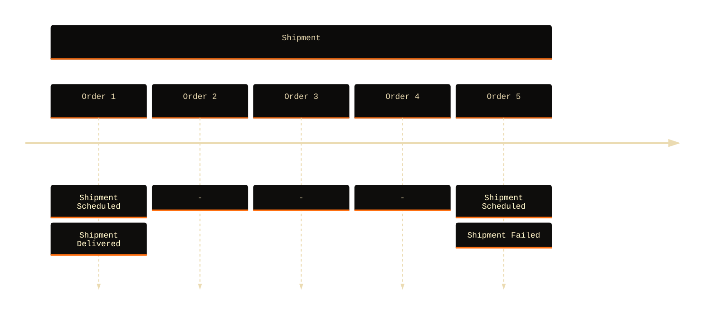
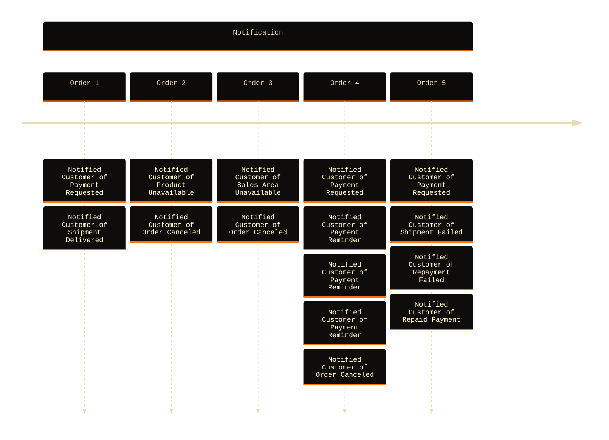
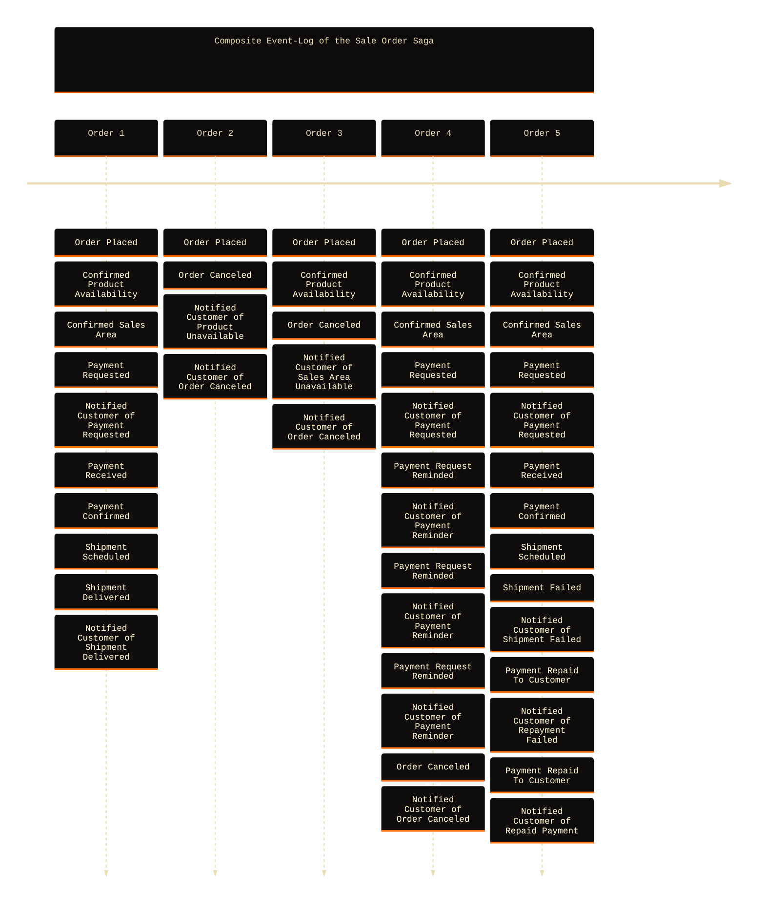

# Sale Order

###### Use Case

---

### Saga

This example uses a **saga** that governs the **Sale Order Fulfillment Process** where each phase (ordering, payment, shipment, notifications) involves event-driven choreography, compensations, retries, and consistent customer communication.

---

> _View diagram on [mermaid.live](https://mermaid.live/edit#pako:eNq1WFtvozgU_isW-7IrJRUYQhIeKgWYSiPtzlab7jyM8uKAk1oFOwumSrbqfx-bqwmYpittqkaq-53v3M8xvBkRi7HhGfP5fEd3NGL0QI7ejgLxSdCFFdwDOHmpDxh78UCUoDwnUXXEn3GKPbBHOVYOvqOMoH2C85pJfvYoejlmrKCxB3bGL1YITWjtjA5wYJQ_oJQkFwlIGWX5CUVYhZwykqLsErCEZRqWGvKEz7yDffFD34cS1gFRxFnmsyzGFQau5I9KVSL6RMvAfXCdAeh3QvGUUTk5UpR0iNBdhOaXIUJndYNK0B4nPjv7L8cpdS2s9E5Ru1yvR5B9rUPbRNpPV5gBkQgDeUWcMHqtdGieglX9GJLm-J8C0wh_K9K9SmmWnyqddeE20JCgY4bSuhYJTzD4U9oDtuiIqlNUcEZLxqYc9uwMsuP-V8ecger3NxBkGPFaWKkulHESkROiHGwsgPKa_TERlRprcGaHC5CwMdEioUQGsgezFMfgMWNxEYnzV0REpkhC-EUjafclt0g0H9gIHyo8prHe1Ud0STHl48x-6WUNAX_JMOdc54Bvq-BvTApEmLxq8Y4ODzYHLuJli4OUUBG6XMOwHDGvEdJphX2ZSQsXKrYNsAbs9olPiMTgiYGgyDlLmzqazMX2mZz0yQjKZDQYsI2ecVxoyymAPXSIxUDXYu0e9isFTxmiOdEZ4lxTixBmWvJFD_0gqrmBTgZDFAQ5kKgcFePMoQkkdQUUVdNEGrDDTR0XWnr5pvv-pqjqvwRrSKCepGvEG3jsCZ6rLAINhXMDxUfJDRe32TGV8tC9gaMqBJ0rSz1D3VpNp2kIVhO5vZ5nOo71LRzVhNJVmDnpxmXQEkMGq8ewxVGRiU0gGb7SV5QokagHlNIxbYNV3xtrfn-_gV6DnNgx9bZMlCoR0vOzlG6k5MjeDKu61BJaXmX0ZRwOrvAb06u79XrrbkxJZ7Z0agyb_lZlcJKrxkBJbncujy7HMW-h9FYIftTEpYYQtvYpoIGyzqL_y11bSPsi9s0y7K13xVe_TNKqS1JdQ1uOeJEDru6t9v5_6hT59nx-74vwjO975b6nBrWWFCYuvbp1pjrzSnA55VsPFa5vcqyR6cewZHGkroX36etJKbyYzPB_yXKvmdU0QpkG6GkuND6s3WgbvgnZSMVLrrMEfzxXWm4xnlofPjmaejEvQxYIruZWc3UXUlwOpMuBcHn8bhOUZtmdVe19SVvZgazlwPb0SzKQNRs6nyJ1JKnjaZdmIEssXHyKcyE5F974bSqQMQzd2wi7GV-K-a5XLaSBzl6JSAPOElsvb0E5LjUcGFeqeHYZkx6gw6Wmk8f6ol9Sblmf5s2TQPAYM-OYkdjweFbgmSH-lSL5p_EmITujfL-xM-RzaIyyF_kQ-i5kxKb-wVjaiGWsOD4b3gEJe2ZGcYrFs2T9aNpCMC2fkwvKDc9ZOiWH4b0ZZ8ObO5Z9t1pDaK6XENoutGbGRRxb5urOWTsL11mtLMeyLPg-M_4t9cI7y7VtyxWP0EJo5cCZgWPCWfZH9YKnfM_z_hMKKYNd)_

---

**Create Order:**

- Begins when the sale order is placed (`Order Placed`).
- The product availability is confirmed; failure results in cancellation and customer notification.
- If available, the sales area is confirmed; failure also leads to cancellation.
- Success in both leads to the payment phase.

**Payment:**

- Payment is requested and the customer is notified.
- If no payment is received, reminders are issued. After three failed attempts, the order is canceled.
- If payment is received, it must be verified.
- Invalid payment confirmations trigger alerts to the security context.

**Shipment:**

- Upon payment confirmation, a shipment is scheduled.
- The process handles real-world conditions: delays, transit, delivery, or failure.
- In case of failure, the customer is refunded; retry logic is applied if repayment fails.

**Notification:**

- At each decision point, the customer is kept informed.
- Notifications reflect product availability, payment reminders, shipment status, cancellations, and repayment status.
- Security is notified in case of suspicious activity, _e.g., invalid payment_.

---

### Example: Event-Log

Examples below are different **event-log** representations of sale orders processed by the **saga** described above.

---

---

---

---

---

### Example: Event-Log Composite

Below example shows a **composite event-log** representation of the same **event-log** examples listed above.

---

### Work in Progress

... to be continued